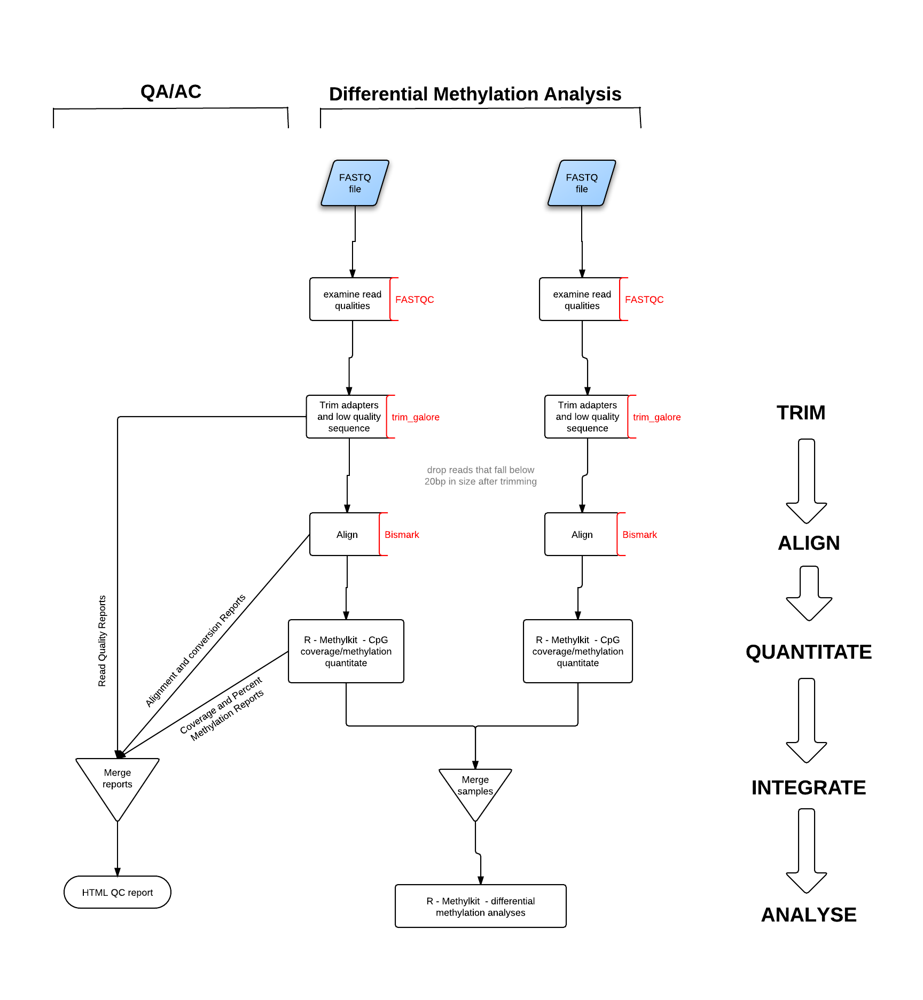

#Scripts for running RRBS QC

##Features
-  scripts to run quality checks on RRBS data  

- initial [FASTQC](http://www.bioinformatics.babraham.ac.uk/projects/fastqc/) for read quality
- [trim_galore](http://www.bioinformatics.babraham.ac.uk/projects/trim_galore/) to trim low quality bases, adapter sequences and bases artificially introduced in the end-repir step during the library preparation, with post-trimming FASTQC report  
- mapping of bisulfite converted sequence reads and determination cytosine methylation states with [Bismark](http://www.bioinformatics.babraham.ac.uk/projects/bismark/) (Bowtie-based)  
- [Methylkit](http://code.google.com/p/methylkit/) based analysis to show CpG coverage and %CpG methylation distributions
- generates a single html report for each sample 

##Dependencies

- **[bpipe](http://code.google.com/p/bpipe/)** binary directory must be in PATH

- **bismark** binary directory must be in PATH  

- **Reference genome(s)** must be preprepared with bismark_genome_preparation  

	- mm9 UCSC based genome is currently stored on Odyssey at:
	` /n/scratch00/hsph/biodata/genomes/Mmusculus/mm9/bismark/UCSC`  
	
	- hg19 UCSC base genome is currently stored on Odyssety at:
	`/n/scratch00/hsph/biodata/genomes/Hsapiens/hg19/bismark/UCSC`  
	

- **[Picard](http://picard.sourceforge.net/command-line-overview.shtml)** tools available on system  

- On Odyssey, load **modules**:  

	- bio/cutadapt-1 *(for trimming)*  
	- bio/bowtie *(for alignment)*  
	- hpc/pandoc-1.9.3_ghc-7.4.1 *(for converion of QC report into html)*  
	- math/R-2.15.0 *(for methykit)*
	- hpc/java-1.6 *(for Picard based alignment (sam format) coordinate-based sorting)*

##Description of scripts
**rrbs_trim_align_quant.j** - wrapper for entire analysis  

***Subscripts***  
**knitr_quant_meth_methylkit.r**  - wrapper for quant_meth_methylkit.rmd  
**quant_meth_methylkit.rmd** - generates markdown formatted output for initial methylkit QC   
**compile_results.sh** - compiles final reports from FastQC, trim_galore, Bismark aligner and methylkit into html form  

##How do I run this?
- edit the rrbs_trim_align_quant.j **VARIABLES** section to suit your analysis  
 
**DIRECTORIES**  
`BASEDIR` - where your data is stored  
`TMPDIR` - temporary directory for java based commands  
`SCRIPTDIR` - directory where these scripts are located  
`PICARDDIR` - directory where the Picard tools are located (on Odyssey they are at: `/n/HSPH/local/share/java/picard`)

**- for all the DIRECTORIES variables, do not put a backslash at the end of the string**

**TRIM VARIABLES**  
`QUALITY - trim bases from reads with phred quality scores lower than this`
[(phred quality scores)](http://en.wikipedia.org/wiki/Phred_quality_score)

**BISMARK ALIGNER VARIABLES**  
`BUILD`- genome build  
`DIRECTIONVAR`- is the library directional (you only sequenced the bisulfite converted forward OR reverse strand ) or non-direcitonal (you sequenced both the bisulfite converted forward AND reverse strands) *(options are "directional" or "non_directional", including the quotation marks)*  
`REFERENCEGENOMEDIR`- directory where your bismark prepared reference genome is located

**METHYLKIT CpG QUANTITATION VARIABLES**  
`MINIMUMCOVERAGE` - minimum read coverage to call a methylation status for a base  
`MINIMUMQUALITY` - minimum phred quality score to call a methylation status for a base  

- run rrbs_trim_align_quant.j from within `BASEDIR`, i.e. the directory where the data is located
 	- 	the scripts themselves do not have to be located within this directory, just the data
 	
 	**Example command:**  
 	`bpipe run -r /directory_with_these_scripts/rrbs_trim_align_quant.j *fastq`
 	
##Miscellaneous Notes  

- the script will generate quite a few directories and files, but the important ones to keep are the `figures`, `fastqc` 
- the `docs` directory contains the report for the bpipe run, with times each stage took
- the `methylation_quantitation_results` directory contains the *methylkit* generated CpG methylation quantitations, that can be reloaded into *methylkit* to do the differential methylation analyses

 	
 	
